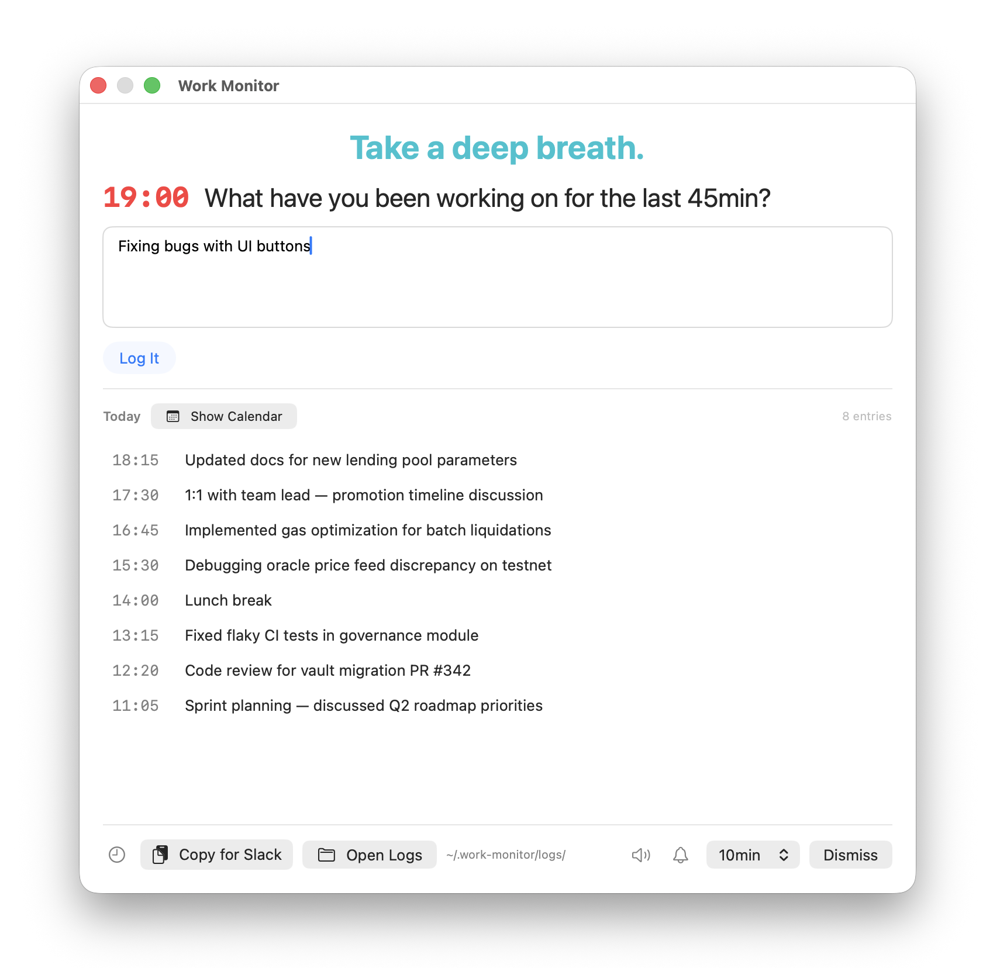

# Work Monitor

A lightweight macOS menu bar app that reminds you to log what you're working on. Built for constructing daily standup updates without trying to remember everything at the end of the day.



## Features

- **Menu bar app** -- lives in the top bar, click the clock icon anytime
- **Periodic reminders** -- floating panel pops up at configurable intervals (1min to 1hr), aligned to round clock times
- **Motivational nudges** -- random messages remind you to stretch, hydrate, and take breaks
- **Time tracking** -- shows how long since your last log entry
- **Copy for Slack** -- one click copies a formatted daily update to clipboard
- **Calendar view** -- browse past days' logs with a built-in calendar (green dots show days with entries)
- **Customizable** -- toggle sound, reminders, timestamps; adjust reminder interval
- **Works over full-screen apps** -- the floating panel appears above everything
- **Non-intrusive focus** -- panel appears 0.75s before stealing focus so you can finish typing
- **Auto-dismiss** -- after logging from a reminder, the panel auto-closes with a 1s countdown (click or type to cancel)
- **No special permissions** -- no accessibility, no screen recording, just a plain app
- **Launch at Login** -- right-click menu option to start automatically

## Install

### Build from source

Requires macOS 14+ and Xcode Command Line Tools.

```bash
git clone https://github.com/vicnaum/work-monitor.git
cd work-monitor
./build.sh
cp -r WorkMonitor.app /Applications/
```

### Download binary

Download the latest `WorkMonitor.app.zip` from [Releases](https://github.com/vicnaum/work-monitor/releases).

Since the app is not notarized, macOS will show a warning on first launch. To bypass:
- Right-click the app > Open, or
- `xattr -cr /Applications/WorkMonitor.app`

## Usage

- **Left-click** menu bar icon -- toggle the panel
- **Right-click** menu bar icon -- Launch at Login, sound toggle, quit
- **Enter** -- submit log entry
- **Escape** -- dismiss the panel
- Bottom bar icons: toggle timestamps, sound, reminders, adjust interval

## Tests

```bash
swift test
```

35 tests covering date formatting, calendar math, entry persistence, deletion cleanup, Slack formatting, and date navigation.

## Logs

Stored in `~/.work-monitor/logs/` as daily files:
- `2026-04-15.json` -- machine-readable (used by the app)
- `2026-04-15.md` -- human-readable markdown

## License

MIT
